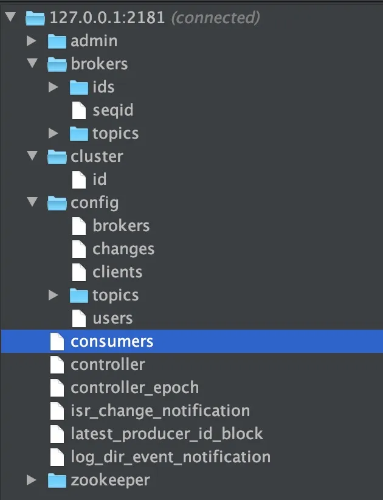
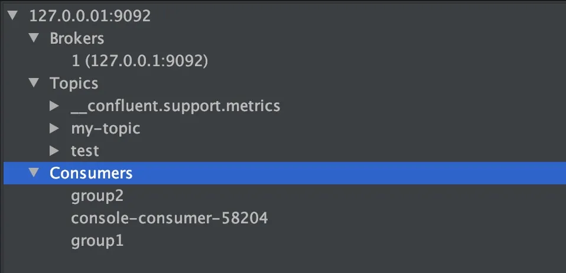

# springboot-kafka
SpringBoot整合kafka

## 学习链接
1. https://mp.weixin.qq.com/s/qttczGROYoqSulzi8FLXww **面试官问我如何保证Kafka不丢失消息?我哭了！**
2. https://javaguide.cn/high-performance/message-queue/kafka-questions-01.html **Kafka常见问题总结**
3. https://kafka.apache.org/documentation/ **Kafka 官方文档**
4. https://github.com/conduktor/kafka-stack-docker-compose **Kafka Docker Compose 启动方式**

## IDEA kafka插件相关
1. Zoolytic-Zookeeper tool
   这是一款 IDEA 提供的 Zookeeper 可视化工具插件，非常好用！我们可以通过它
   - 1.1 可视化ZkNodes节点信息
   - 1.2 ZkNodes节点管理-添加/删除
   - 1.3 编辑zkNodes数据
   ......
   
   使用方法：
   打开工具：View->Tool windows->Zoolytic；
   点击 “+” 号后在弹出框数据：“127.0.0.1:2181” 连接 zookeeper；
   连接之后点击新创建的连接然后点击“+”号旁边的刷新按钮即可

2. Kafkalytic
   IDEA 提供的 Kafka 可视化管理插件。这个插件为我们提供了下面这写功能：
   - 2.1 多个集群支持
   - 2.2 主题管理:创建/删除/更改分区
   - 2.3 使用正则表达式搜索主题
   - 2.4 发布字符串/字节序列化的消息
   - 2.5 使用不同的策略消费消息
   
   使用方法：
   打开工具：View->Tool windows->kafkalytic； 
   点击 “+” 号后在弹出框数据：“127.0.0.1:9092” 连接；

   